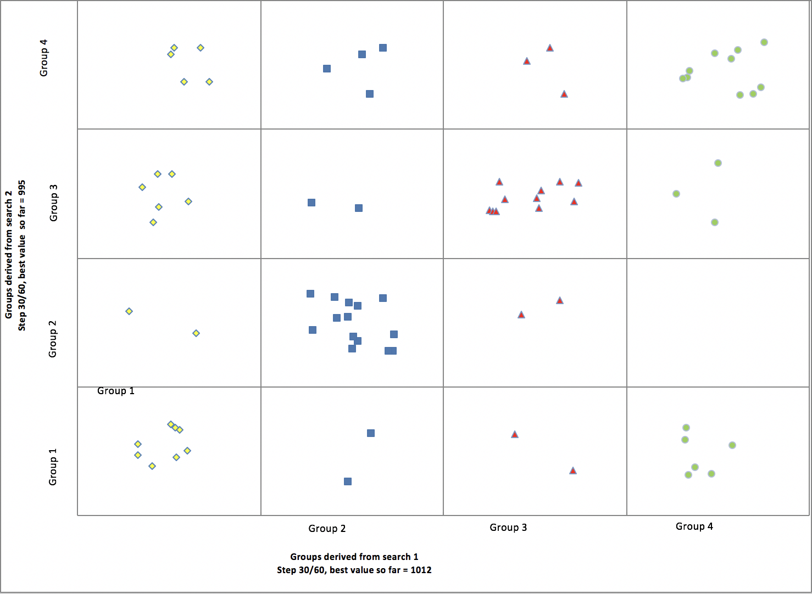

# Team_Allocation

Personnel allocation to appropriate projects based on personal performance score and satisfaction score. 

Note: this is a recreation of school project from Excel to Tableau.

Step 1: Problem set up:
- There are 80 members and 4 projects.
- For each project, individual member will have their own performance score and satisfaction score. 
- Purpose of the task is to allocation each member to the appropriate assignment to maximize total score. 
- Each project is expected to have at most 22 members and at least 18 members so that they won't overrun their management costs.
- If any project allocation solutions exceed the specified numbers above, there will be 10 points penalty to the solution. 

Step 2: Random assignment 1:
- Initial assignment to 80 members (i.e: 1,2,3,4 and then 1,2,3,4 until the last line).
- Use tool Risk Optimizer to maximize the score based on initial assignment.
- Set up for Risk Optimizer to run for only 10 minutes. 

Step 3: Random assignment 2:
- Second assignment to 80 members (i.e: 1,1,1,1 and then 2,2,2,2 until the last line). 
- Use tool Risk Optimizer to maximize the score based on second asisignment. 
- Set up for Risk Optimizer to run for only 10 minutes. 

Step 4: Data visualization
- Use Tableau to visualize the group allocation results at midpoint (minute 5) and end point (minute 10)
- Conclusion: final allocation result is based on initial assignment. 

